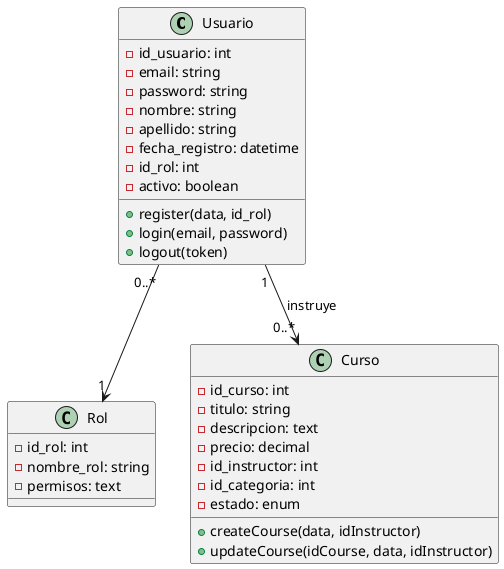
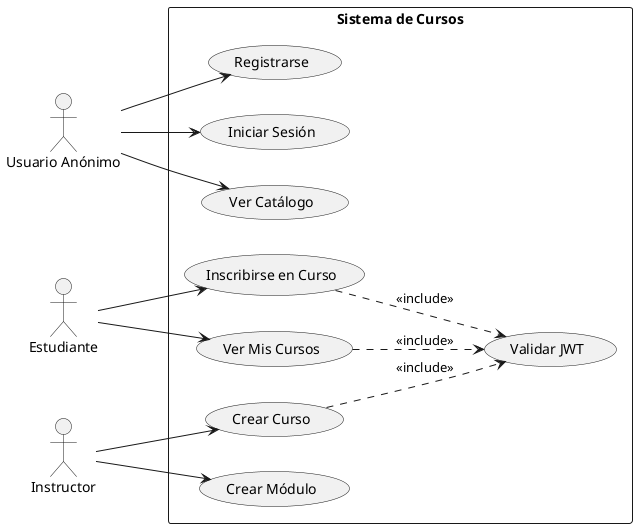

# Documentación de Diagramas UML - Sistema de Cursos

## 1. Diagrama de Clases

### Clases Principales del Dominio

```pseudocode
CLASE Usuario {
  - id_usuario: int (PK)
  - email: string (UNIQUE)
  - password: string (HASH)
  - nombre: string
  - apellido: string
  - fecha_registro: datetime
  - id_rol: int (FK → Rol)
  - activo: boolean
  
  + register(data, id_rol)
  + login(email, password)
  + logout(token)
  + validateToken(token)
  + getUserFromToken(token)
}

CLASE Rol {
  - id_rol: int (PK)
  - nombre_rol: string
  - permisos: text
}

CLASE Categoria {
  - id_categoria: int (PK)
  - nombre_categoria: string
  - descripcion: text
}

CLASE Curso {
  - id_curso: int (PK)
  - titulo: string
  - descripcion: text
  - imagen_portada: string
  - precio: decimal
  - id_instructor: int (FK → Usuario)
  - id_categoria: int (FK → Categoria)
  - fecha_creacion: datetime
  - estado: enum('borrador', 'publicado', 'oculto', 'eliminado')
  
  + createCourse(data, idInstructor)
  + updateCourse(idCourse, data, idInstructor)
  + removeCourse(idCourse, idInstructor)
  + getInstructorCourses(idInstructor)
  + obtenerCursos()
  + obtenerCursoPorId(id)
}

CLASE Modulo {
  - id_modulo: int (PK)
  - id_curso: int (FK → Curso)
  - titulo: string
  - orden: int
  - deleted_at: datetime (SOFT DELETE)
  
  + createModule(data, idInstructor)
  + getModulesByCourse(idCurso)
  + updateModule(idModulo, data, idInstructor)
  + deleteModule(idModulo, idInstructor)
}

CLASE Leccion {
  - id_leccion: int (PK)
  - id_modulo: int (FK → Modulo)
  - titulo: string
  - contenido: text
  - duracion: int (minutos)
  - orden: int
  - tipo: enum('video', 'texto', 'quiz', 'recurso')
  - deleted_at: datetime (SOFT DELETE)
  
  + createLesson(data, idInstructor)
  + getLessonsByModule(idModulo)
  + updateLesson(idLesson, data, idInstructor)
  + deleteLesson(idLesson, idInstructor)
}

CLASE Recurso {
  - id_recurso: int (PK)
  - id_leccion: int (FK → Leccion)
  - tipo: enum('video', 'pdf', 'link', 'imagen')
  - url: string
  - titulo: string
  - created_at: timestamp
  - updated_at: timestamp
  - deleted_at: timestamp (SOFT DELETE)
  
  + createResource(data, idInstructor)
  + getResourcesByLesson(idLeccion)
  + updateResource(idRecurso, data, idInstructor)
  + deleteResource(idRecurso, idInstructor)
}

CLASE Inscripcion {
  - id_inscripcion: int (PK)
  - id_usuario: int (FK → Usuario)
  - id_curso: int (FK → Curso)
  - fecha_inscripcion: datetime
  - progreso: decimal
  - estado: enum('pendiente', 'en_curso', 'completado', 'cancelado')
  
  + enRoll(idUser, idCourse)
  + getMyCourses(id)
}

CLASE ProgresoLeccion {
  - id_progreso: int (PK)
  - id_inscripcion: int (FK → Inscripcion)
  - id_leccion: int (FK → Leccion)
  - completado: boolean
  - fecha_completado: datetime
}

CLASE Comentario {
  - id_comentario: int (PK)
  - id_usuario: int (FK → Usuario)
  - id_curso: int (FK → Curso)
  - contenido: text
  - fecha_comentario: timestamp
  - respuesta_a: int (FK → Comentario) (SELF-REFERENCE)
  
  + agregarComentario(usuarioID, cursoID, contenido)
  + eliminarComentario(usuarioID, id_comentario)
}

CLASE Valoracion {
  - id_valoracion: int (PK)
  - id_curso: int (FK → Curso)
  - id_usuario: int (FK → Usuario)
  - puntuacion: int (1-5)
  - comentario: text
  - fecha_valoracion: datetime
  - activo: boolean
}

CLASE Favorito {
  - id: int (PK)
  - id_usuario: int (FK → Usuario)
  - id_curso: int (FK → Curso)
  - created_at: timestamp
  - updated_at: timestamp
  
  + agregarFavorito(usuarioID, cursoID)
  + eliminarFavorito(usuarioID, cursoID)
}
```

### Relaciones entre Clases

```pseudocode
RELACIONES:
  Usuario "1" ──< "0..*" Curso (como instructor)
  Usuario "1" ──< "0..*" Inscripcion
  Usuario "1" ──< "0..*" Comentario
  Usuario "1" ──< "0..*" Valoracion
  Usuario "1" ──< "0..*" Favorito
  Usuario "0..*" ──> "1" Rol
  
  Categoria "1" ──< "0..*" Curso
  
  Curso "1" ──< "0..*" Modulo
  Curso "1" ──< "0..*" Inscripcion
  Curso "1" ──< "0..*" Comentario
  Curso "1" ──< "0..*" Valoracion
  Curso "1" ──< "0..*" Favorito
  
  Modulo "1" ──< "0..*" Leccion
  
  Leccion "1" ──< "0..*" Recurso
  Leccion "1" ──< "0..*" ProgresoLeccion
  
  Inscripcion "1" ──< "0..*" ProgresoLeccion
  
  Comentario "0..1" ──< "0..*" Comentario (respuestas)
```

### Clases de Servicio (Capa de Negocio)

```pseudocode
CLASE AuthService {
  + register(data, id_rol): Usuario
  + login(email, password): {token, user}
  + logout(token): boolean
  + validateToken(token): boolean
  + getUserFromToken(token): Usuario
}

CLASE CursoService {
  + obtenerCursos(): Curso[]
  + obtenerCursoPorId(id): Curso
  + getMyCourses(id): Curso[]
  + enRoll(idUser, idCourse): void
  + createCourse(data, idInstructor): Curso
  + updateCourse(idCourse, data, idInstructor): void
  + removeCourse(idCourse, idInstructor): boolean
  + getInstructorCourses(idInstructor): Curso[]
}

CLASE ModuleService {
  + createModule(data, idInstructor): Modulo
  + getModulesByCourse(idCurso): Modulo[]
  + updateModule(idModulo, data, idInstructor): boolean
  + deleteModule(idModulo, idInstructor): boolean
}

CLASE LessonService {
  + createLesson(data, idInstructor): Leccion
  + getLessonsByModule(idModulo): Leccion[]
  + updateLesson(idLesson, data, idInstructor): boolean
  + deleteLesson(idLesson, idInstructor): boolean
}

CLASE ResourceService {
  + createResource(data, idInstructor): Recurso
  + getResourcesByLesson(idLeccion): Recurso[]
  + updateResource(idRecurso, data, idInstructor): boolean
  + deleteResource(idRecurso, idInstructor): boolean
}

CLASE PlayerService {
  + getCourseContent(idCurso, idEstudiante): Modulo[]
}

CLASE ComentarioService {
  + agregarComentario(usuarioID, cursoID, contenido): object
  + eliminarComentario(usuarioID, id_comentario): object
}

CLASE FavoritoService {
  + agregarFavorito(usuarioID, cursoID): object
  + eliminarFavorito(usuarioID, cursoID): object
}
```

### Clases Controladoras (API)

```pseudocode
CLASE AuthController {
  - authService: AuthService
  
  + register(request): Response
  + registerInstructor(request): Response
  + login(request): Response
  + logout(request): Response
}

CLASE CursoController {
  - cursoService: CursoService
  - authService: AuthService
  
  + index(): Response
  + show(id): Response
  + indexMyCourses(request): Response
  + enroll(request): Response
  + indexCoursesInstructor(request): Response
  + storeCourseInstructor(request): Response
  + updateCourseInstructor(request, id): Response
  + destroyCoursesInstructor(id): Response
}

CLASE ModuleController {
  - moduleService: ModuleService
  - authService: AuthService
  
  + indexModules(idCourse): Response
  + storeModule(request): Response
  + updateModule(request, idModule): Response
  + destroyModule(idModule): Response
}

CLASE LessonController {
  - lessonService: LessonService
  - authService: AuthService
  
  + indexLessons(idModule): Response
  + storeLesson(request): Response
  + updateLesson(request, idLesson): Response
  + destroyLesson(idLesson): Response
}

CLASE ResourceController {
  - resourceService: ResourceService
  - authService: AuthService
  
  + indexResource(idLesson): Response
  + storeResource(request): Response
  + updateResource(request, idResource): Response
  + destroyResource(idResource): Response
}

CLASE PlayerController {
  - playerService: PlayerService
  - authService: AuthService
  
  + getCourseContent(idCurso): Response
}

CLASE ComentarioController {
  - comentarioService: ComentarioService
  
  + agregarComentario(request): Response
  + eliminarComentario(request, id_comentario): Response
}

CLASE FavoritoController {
  - favoritoService: FavoritoService
  
  + agregarFavorito(request): Response
  + eliminarFavorito(request): Response
}
```

---

## 2. Diagrama de Casos de Uso

### Actores

```pseudocode
ACTOR: Usuario Anónimo
ACTOR: Estudiante (Usuario autenticado con rol = 2)
ACTOR: Instructor (Usuario autenticado con rol = 1)
ACTOR: Sistema (para procesos automáticos)
```

### Casos de Uso por Actor

#### **Usuario Anónimo**

```pseudocode
CU01: Registrarse como Estudiante
  - Actor: Usuario Anónimo
  - Precondición: Ninguna
  - Flujo:
    1. Usuario ingresa datos (email, password, nombre, apellido)
    2. Sistema valida datos
    3. Sistema crea usuario con rol=2
    4. Sistema retorna usuario creado
  - Postcondición: Usuario registrado en BD

CU02: Registrarse como Instructor
  - Actor: Usuario Anónimo
  - Precondición: Ninguna
  - Flujo:
    1. Usuario ingresa datos (email, password, nombre, apellido)
    2. Sistema valida datos
    3. Sistema crea usuario con rol=1
    4. Sistema retorna usuario creado
  - Postcondición: Usuario instructor registrado en BD

CU03: Iniciar Sesión
  - Actor: Usuario Anónimo
  - Precondición: Usuario debe estar registrado
  - Flujo:
    1. Usuario ingresa email y password
    2. Sistema valida credenciales
    3. Sistema genera token JWT
    4. Sistema retorna token y datos del usuario
  - Postcondición: Usuario autenticado con token válido

CU04: Ver Catálogo Público de Cursos
  - Actor: Usuario Anónimo
  - Precondición: Ninguna
  - Flujo:
    1. Usuario accede al catálogo público
    2. Sistema retorna cursos con estado='publicado'
  - Postcondición: Usuario ve lista de cursos

CU05: Ver Detalles de un Curso
  - Actor: Usuario Anónimo
  - Precondición: Curso debe existir y estar publicado
  - Flujo:
    1. Usuario selecciona un curso
    2. Sistema retorna información completa del curso
  - Postcondición: Usuario ve detalles del curso
```

#### **Estudiante (Usuario Autenticado)**

```pseudocode
CU06: Inscribirse en un Curso
  - Actor: Estudiante
  - Precondición: Usuario autenticado, curso publicado
  - Flujo:
    1. Estudiante selecciona curso
    2. Sistema valida que curso esté publicado
    3. Sistema valida que usuario no esté ya inscrito
    4. Sistema crea inscripción con estado='en_curso'
  - Postcondición: Estudiante inscrito en el curso

CU07: Ver Mis Cursos
  - Actor: Estudiante
  - Precondición: Usuario autenticado
  - Flujo:
    1. Estudiante solicita sus cursos
    2. Sistema retorna cursos donde está inscrito
  - Postcondición: Usuario ve lista de sus cursos

CU08: Acceder al Reproductor de Curso
  - Actor: Estudiante
  - Precondición: Usuario inscrito en el curso
  - Flujo:
    1. Estudiante accede al curso
    2. Sistema valida inscripción
    3. Sistema retorna módulos, lecciones y recursos
  - Postcondición: Usuario accede al contenido del curso

CU09: Agregar Curso a Favoritos
  - Actor: Estudiante
  - Precondición: Usuario autenticado, curso existe
  - Flujo:
    1. Estudiante marca curso como favorito
    2. Sistema valida que no esté ya en favoritos
    3. Sistema crea registro en favoritos
  - Postcondición: Curso agregado a favoritos

CU10: Eliminar Curso de Favoritos
  - Actor: Estudiante
  - Precondición: Curso debe estar en favoritos
  - Flujo:
    1. Estudiante elimina favorito
    2. Sistema valida que exista el favorito
    3. Sistema elimina registro
  - Postcondición: Curso eliminado de favoritos

CU11: Agregar Comentario a un Curso
  - Actor: Estudiante
  - Precondición: Usuario autenticado
  - Flujo:
    1. Estudiante escribe comentario
    2. Sistema valida token JWT
    3. Sistema guarda comentario
  - Postcondición: Comentario agregado al curso

CU12: Eliminar Comentario Propio
  - Actor: Estudiante
  - Precondición: Comentario debe pertenecer al usuario
  - Flujo:
    1. Estudiante solicita eliminar comentario
    2. Sistema valida propiedad
    3. Sistema elimina comentario
  - Postcondición: Comentario eliminado

CU13: Cerrar Sesión
  - Actor: Estudiante/Instructor
  - Precondición: Usuario autenticado
  - Flujo:
    1. Usuario solicita cerrar sesión
    2. Sistema invalida token JWT
  - Postcondición: Sesión cerrada
```

#### **Instructor (Usuario Autenticado con rol=1)**

```pseudocode
CU14: Crear Curso
  - Actor: Instructor
  - Precondición: Usuario con rol=1
  - Flujo:
    1. Instructor ingresa datos del curso (título, descripción, precio, imagen, categoría)
    2. Sistema valida permisos
    3. Sistema guarda curso con estado='borrador'
  - Postcondición: Curso creado

CU15: Ver Mis Cursos (Instructor)
  - Actor: Instructor
  - Precondición: Usuario con rol=1
  - Flujo:
    1. Instructor solicita sus cursos
    2. Sistema retorna cursos donde es instructor (estado != 'eliminado')
  - Postcondición: Instructor ve sus cursos

CU16: Actualizar Curso
  - Actor: Instructor
  - Precondición: Curso debe pertenecer al instructor
  - Flujo:
    1. Instructor actualiza datos del curso
    2. Sistema valida propiedad
    3. Sistema actualiza curso
  - Postcondición: Curso actualizado

CU17: Eliminar Curso (Soft Delete)
  - Actor: Instructor
  - Precondición: Curso debe pertenecer al instructor
  - Flujo:
    1. Instructor elimina curso
    2. Sistema valida propiedad
    3. Sistema marca estado='eliminado'
  - Postcondición: Curso marcado como eliminado

CU18: Crear Módulo
  - Actor: Instructor
  - Precondición: Curso debe pertenecer al instructor
  - Flujo:
    1. Instructor crea módulo en su curso
    2. Sistema valida propiedad del curso
    3. Sistema crea módulo
  - Postcondición: Módulo creado

CU19: Ver Módulos de un Curso
  - Actor: Instructor
  - Precondición: Curso debe pertenecer al instructor
  - Flujo:
    1. Instructor solicita módulos
    2. Sistema valida permisos
    3. Sistema retorna módulos ordenados
  - Postcondición: Instructor ve módulos del curso

CU20: Actualizar Módulo
  - Actor: Instructor
  - Precondición: Módulo debe pertenecer a curso del instructor
  - Flujo:
    1. Instructor actualiza módulo
    2. Sistema valida propiedad
    3. Sistema actualiza módulo
  - Postcondición: Módulo actualizado

CU21: Eliminar Módulo (Soft Delete)
  - Actor: Instructor
  - Precondición: Módulo debe pertenecer a curso del instructor
  - Flujo:
    1. Instructor elimina módulo
    2. Sistema valida propiedad
    3. Sistema marca deleted_at
  - Postcondición: Módulo eliminado lógicamente

CU22: Crear Lección
  - Actor: Instructor
  - Precondición: Módulo debe pertenecer a curso del instructor
  - Flujo:
    1. Instructor crea lección en módulo
    2. Sistema valida propiedad
    3. Sistema crea lección
  - Postcondición: Lección creada

CU23: Ver Lecciones de un Módulo
  - Actor: Instructor
  - Precondición: Módulo debe pertenecer a curso del instructor
  - Flujo:
    1. Instructor solicita lecciones
    2. Sistema valida permisos
    3. Sistema retorna lecciones ordenadas
  - Postcondición: Instructor ve lecciones

CU24: Actualizar Lección
  - Actor: Instructor
  - Precondición: Lección debe pertenecer a curso del instructor
  - Flujo:
    1. Instructor actualiza lección
    2. Sistema valida propiedad
    3. Sistema actualiza lección
  - Postcondición: Lección actualizada

CU25: Eliminar Lección (Soft Delete)
  - Actor: Instructor
  - Precondición: Lección debe pertenecer a curso del instructor
  - Flujo:
    1. Instructor elimina lección
    2. Sistema valida propiedad
    3. Sistema marca deleted_at
  - Postcondición: Lección eliminada lógicamente

CU26: Crear Recurso
  - Actor: Instructor
  - Precondición: Lección debe pertenecer a curso del instructor
  - Flujo:
    1. Instructor crea recurso (video/pdf/link/imagen)
    2. Sistema valida propiedad
    3. Si es archivo, sistema guarda en storage
    4. Sistema crea registro de recurso
  - Postcondición: Recurso creado

CU27: Ver Recursos de una Lección
  - Actor: Instructor
  - Precondición: Lección debe pertenecer a curso del instructor
  - Flujo:
    1. Instructor solicita recursos
    2. Sistema valida permisos
    3. Sistema retorna recursos
  - Postcondición: Instructor ve recursos

CU28: Actualizar Recurso
  - Actor: Instructor
  - Precondición: Recurso debe pertenecer a curso del instructor
  - Flujo:
    1. Instructor actualiza recurso
    2. Sistema valida propiedad
    3. Si es archivo nuevo, elimina anterior y guarda nuevo
    4. Sistema actualiza registro
  - Postcondición: Recurso actualizado

CU29: Eliminar Recurso (Soft Delete)
  - Actor: Instructor
  - Precondición: Recurso debe pertenecer a curso del instructor
  - Flujo:
    1. Instructor elimina recurso
    2. Sistema valida propiedad
    3. Sistema marca deleted_at
  - Postcondición: Recurso eliminado lógicamente

CU30: Acceder al Reproductor de Curso (Instructor)
  - Actor: Instructor
  - Precondición: Usuario es el instructor del curso
  - Flujo:
    1. Instructor accede al curso
    2. Sistema valida que sea el instructor
    3. Sistema retorna módulos, lecciones y recursos
  - Postcondición: Instructor accede al contenido del curso
```

### Relaciones entre Casos de Uso

```pseudocode
INCLUSIONES (<<include>>):
  - CU06 (Inscribirse) <<include>> Validar JWT
  - CU07 (Mis Cursos) <<include>> Validar JWT
  - CU08 (Reproductor) <<include>> Validar Inscripción
  - CU09 (Agregar Favorito) <<include>> Validar JWT
  - CU11 (Agregar Comentario) <<include>> Validar JWT
  - CU14-CU30 (Operaciones Instructor) <<include>> Validar Rol=1

EXTENSIONES (<<extend>>):
  - CU30 (Reproductor Instructor) <<extend>> CU08 (Reproductor Estudiante)
    [Condición: Si usuario es instructor del curso]

GENERALIZACIONES:
  - CU15 (Ver Cursos Instructor) → CU07 (Ver Mis Cursos)
    [CU15 es especialización de CU07 para instructores]
```

---

## 3. Diagrama de Componentes (Arquitectura)

```pseudocode
CAPA PRESENTACIÓN:
  - Vistas Blade (login.blade.php, registro.blade.php, catalogo-publico, etc.)
  - Scripts JS (login.js, registro.js, catalogo-private.js, comentarios.js)
  - Componentes Blade (comentarios.blade.php, navbar.blade.php)

CAPA API (Controladores):
  - AuthController
  - CursoController
  - ModuleController
  - LessonController
  - ResourceController
  - PlayerController
  - ComentarioController
  - FavoritoController

CAPA SERVICIOS (Lógica de Negocio):
  - AuthService
  - CursoService
  - ModuleService
  - LessonService
  - ResourceService
  - PlayerService
  - ComentarioService
  - FavoritoService

CAPA MIDDLEWARE:
  - JwtMiddleware (validación de token JWT)

CAPA DATOS:
  - DB (Facade de Laravel)
  - Migraciones (Schema)
  - Storage (archivos)

COMPONENTES EXTERNOS:
  - JWT-Auth (Tymon\JWTAuth)
  - Laravel Framework
  - Bootstrap (Frontend)
```

---

## 4. Resumen de Flujos Clave

### Flujo de Autenticación JWT

```pseudocode
1. Usuario envía credenciales → AuthController.login()
2. AuthService valida credenciales en BD
3. AuthService genera token JWT usando JWTAuth
4. Token retorna al cliente
5. Cliente guarda token en localStorage
6. En cada petición protegida, cliente envía token en header Authorization
7. JwtMiddleware valida token
8. Si es válido, permite acceso; si no, retorna 401
```

### Flujo de Creación de Contenido (Instructor)

```pseudocode
CURSO → MÓDULO → LECCIÓN → RECURSO

1. Instructor crea CURSO (estado='borrador')
2. Instructor crea MÓDULOS dentro del curso
3. Instructor crea LECCIONES dentro de cada módulo
4. Instructor crea RECURSOS (archivos/URLs) en cada lección
5. Instructor actualiza estado del curso a 'publicado'
6. Curso aparece en catálogo público
```

### Flujo de Consumo de Contenido (Estudiante)

```pseudocode
1. Estudiante ve catálogo público
2. Estudiante se inscribe en curso
3. Registro en tabla inscripciones con estado='en_curso'
4. Estudiante accede al reproductor
5. PlayerService valida inscripción
6. PlayerService retorna estructura: Curso → Módulos → Lecciones → Recursos
7. Estudiante consume contenido
8. (Futuro) Sistema registra progreso en progreso_lecciones
```

---

## 5. Herramientas Recomendadas para Generar Diagramas

### 5.1 PlantUML (texto → diagrama)
- Soporta clases, casos de uso, secuencia
- Integración con VSCode
- Sintaxis basada en texto
- Exportación a PNG/SVG

### 5.2 Draw.io / diagrams.net (gráfico)
- Gratis, online y offline
- Plantillas UML predefinidas
- Exportación a múltiples formatos
- Colaboración en tiempo real

### 5.3 StarUML (software)
- Profesional
- Soporte completo UML 2.0
- Exportación a imágenes
- Generación de código

### 5.4 Lucidchart (online)
- Colaborativo
- Plantillas UML
- Integración con Google Drive
- Versión gratuita limitada

---

## 6. Ejemplo de Código PlantUML

### Diagrama de Clases (Ejemplo)



### Diagrama de Casos de Uso (Ejemplo)



---

## 7. Notas de Implementación

### 7.1 Base de Datos
- Motor: MySQL
- Nombre: `prueba_db_laravel`
- Charset: utf8mb4
- Collation: utf8mb4_unicode_ci

### 7.2 Convenciones de Nomenclatura
- Tablas: plural en español (usuarios, cursos, lecciones)
- Primary Keys: id_{nombre_tabla_singular}
- Foreign Keys: id_{tabla_referenciada_singular}
- Soft Deletes: deleted_at (timestamp nullable)

### 7.3 Roles del Sistema
- **rol=1**: Instructor (puede crear y gestionar cursos)
- **rol=2**: Estudiante (puede inscribirse y consumir cursos)

### 7.4 Estados de Curso
- **borrador**: Curso en desarrollo, no visible públicamente
- **publicado**: Curso visible en catálogo público
- **oculto**: Curso no visible pero no eliminado
- **eliminado**: Soft delete, no se muestra en ningún lado

### 7.5 Estados de Inscripción
- **pendiente**: Inscripción creada pero no iniciada
- **en_curso**: Estudiante activamente tomando el curso
- **completado**: Curso finalizado por el estudiante
- **cancelado**: Inscripción cancelada

### 7.6 Tipos de Lección
- **video**: Contenido en formato video
- **texto**: Contenido textual/HTML
- **quiz**: Evaluación o cuestionario
- **recurso**: Material adicional descargable

### 7.7 Tipos de Recurso
- **video**: URL a video (YouTube, Vimeo, etc.)
- **pdf**: Archivo PDF almacenado en storage
- **link**: URL externa
- **imagen**: Archivo de imagen almacenado en storage

---

## 8. Endpoints API Principales

### Autenticación
- `POST /api/register` - Registro de estudiante
- `POST /api/register-instructor` - Registro de instructor
- `POST /api/login` - Inicio de sesión
- `POST /api/logout` - Cierre de sesión

### Cursos (Público)
- `GET /api/cursos` - Listar cursos públicos
- `GET /api/cursos/{id}` - Detalle de curso

### Cursos (Autenticado)
- `GET /api/mis-cursos` - Cursos del estudiante
- `POST /api/inscripcion` - Inscribirse en curso

### Instructor
- `GET /api/instructor/cursos` - Cursos del instructor
- `POST /api/instructor/cursos` - Crear curso
- `PUT /api/instructor/cursos/{id}` - Actualizar curso
- `DELETE /api/instructor/cursos/{id}` - Eliminar curso

### Módulos
- `GET /api/instructor/modulos/{idCurso}` - Listar módulos
- `POST /api/instructor/modulos` - Crear módulo
- `PUT /api/instructor/modulos/{id}` - Actualizar módulo
- `DELETE /api/instructor/modulos/{id}` - Eliminar módulo

### Lecciones
- `GET /api/instructor/lecciones/{idModulo}` - Listar lecciones
- `POST /api/instructor/lecciones` - Crear lección
- `PUT /api/instructor/lecciones/{id}` - Actualizar lección
- `DELETE /api/instructor/lecciones/{id}` - Eliminar lección

### Recursos
- `GET /api/instructor/recursos/{idLeccion}` - Listar recursos
- `POST /api/instructor/recursos` - Crear recurso
- `PUT /api/instructor/recursos/{id}` - Actualizar recurso
- `DELETE /api/instructor/recursos/{id}` - Eliminar recurso

### Reproductor
- `GET /api/player/curso/{id}` - Obtener contenido completo del curso

### Comentarios
- `POST /api/comentarios` - Agregar comentario
- `DELETE /api/comentarios/{id}` - Eliminar comentario

### Favoritos
- `POST /api/favoritos` - Agregar a favoritos
- `DELETE /api/favoritos` - Eliminar de favoritos

---

## 9. Seguridad y Autenticación

### JWT (JSON Web Token)
- Biblioteca: `tymon/jwt-auth`
- Almacenamiento: localStorage (Frontend)
- Transmisión: Header `Authorization: Bearer {token}`
- TTL: Configurable en `config/jwt.php`
- Blacklist: Habilitado para logout

### Middleware
- `jwt.auth`: Protege rutas que requieren autenticación
- Aplicado a todas las rutas `/api/*` que necesitan usuario autenticado

### Validación de Permisos
- **Estudiante**: Puede inscribirse, comentar, agregar favoritos
- **Instructor**: Todo lo del estudiante + gestión de cursos propios
- Validación en Service Layer antes de operaciones críticas

---

## 10. Modelo de Datos Resumido

```
roles
  └─ usuarios
      ├─ cursos (como instructor)
      │   ├─ modulos
      │   │   └─ lecciones
      │   │       └─ recursos
      │   ├─ comentarios
      │   ├─ valoraciones
      │   └─ favoritos
      └─ inscripciones
          └─ progreso_lecciones

categorias
  └─ cursos
```

---

Este documento proporciona toda la información necesaria para generar diagramas UML completos del sistema de cursos, incluyendo clases, casos de uso, componentes y flujos de datos.
